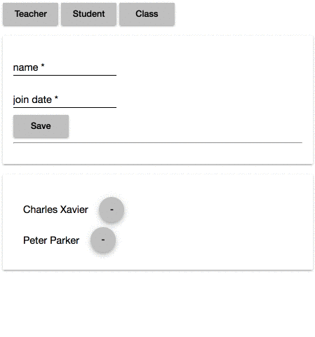

# SilverInventionUi

## Tech Stack
- [angular-cli](https://github.com/angular/angular-cli) version 1.0.0-beta.24
- Angular 2
- Routing
- Material Design for Angular 2
- Nested Components
  - Each Route / Page is a component. They are built of more Components
- Observables based component communication
- In Memory DB for local development of API consumption
- Hammer JS for device interaction

## Development server
Run `ng serve` for a dev server. Navigate to `http://localhost:4200/`. The app will automatically reload if you change any of the source files.

## Code scaffolding

Run `ng generate component component-name` to generate a new component. You can also use `ng generate directive/pipe/service/class/module`.

## Build

Run `ng build` to build the project. The build artifacts will be stored in the `dist/` directory. Use the `-prod` flag for a production build.

## Running unit tests

Run `ng test` to execute the unit tests via [Karma](https://karma-runner.github.io).

## Running end-to-end tests

Run `ng e2e` to execute the end-to-end tests via [Protractor](http://www.protractortest.org/).
Before running the tests make sure you are serving the app via `ng serve`.

## Deploying to Github Pages

Run `ng github-pages:deploy` to deploy to Github Pages.

## Further help

To get more help on the `angular-cli` use `ng help` or go check out the [Angular-CLI README](https://github.com/angular/angular-cli/blob/master/README.md).
